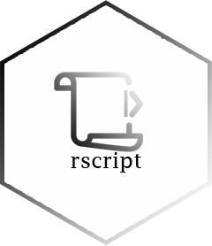

# rscript 


# Overview

Create and comment in script R. The creation of the r script inserts the information from the code development environment such as code editor, platform, author name, among others. Comments can be called interactively with output on the clipboard or in console.

# Installation

- CRAN

You can install the released version of rscript from [CRAN](https://CRAN.R-project.org) with:

``` r
# Wait.
```

- Github

Or install the development version of [Github](https://github.com/):

```
remotes::install_github("brunofariadf/rscript")
```

# Usage

This is a basic example that shows how to use a package function.

- R
``` r
# count line of code in the script
rscript::script_count(list.files("./R", full.names = TRUE))[1:4]
#    check.R engineer.R    error.R     head.R
#        143         89         60         77
```

``` r
# create header to script
rscript::script_head(clipboard = FALSE)
#  [1] "## ------------------------------------------"
#  [2] "##                          Date: 2022-07-28"
#  [3] "## ------------------------------------------"
#  [4] "## Project: "
#  [5] "## Author: "
#  [6] "## "
#  [7] "## GUI: VSCode (1.69.2)"
#  [8] "## Language: R (4.1.0)"
#  [9] "## Platform: Windows"
# [10] "## ------------------------------------------"
```

``` r
# create header to script with python or julia
rscript::script_head(type_language = "python", clipboard = FALSE)
#  [1] "## ------------------------------------------"
#  [2] "##                          Date: 2022-07-28"
#  [3] "## ------------------------------------------"
#  [4] "## Project: "
#  [5] "## Author: "
#  [6] "## "
#  [7] "## GUI: VSCode (1.69.2)"
#  [8] "## Language: Python (3.9.6)"
#  [9] "## Platform: Windows"
# [10] "## ------------------------------------------"

rscript::script_head(type_language = "julia", clipboard = FALSE)
#  [1] "## ------------------------------------------"
#  [2] "##                          Date: 2022-07-28"
#  [3] "## ------------------------------------------"
#  [4] "## Project: "
#  [5] "## Author: "
#  [6] "## "
#  [7] "## GUI: VSCode (1.69.2)"
#  [8] "## Language: Julia (1.7.3)"
#  [9] "## Platform: Windows"
# [10] "## ------------------------------------------"
```

```r
# create 10 R script
script_create("./tests", name_script = letters[1:10])
fs::dir_tree("./tests")
# ./tests
# +-- a.R
# +-- b.R
# +-- c.R
# +-- d.R
# +-- e.R
# +-- f.R
# +-- g.R
# +-- h.R
# +-- i.R
# \-- j.R
```

# Platform

Development.

<div align="center">

|platform | available |
|:--------|:---------:|
|Windows  |    yes    |
|Linux    |    no     |
|MacOS    |    no     |

</div>

# Code of Conduct

Please note that the project is released with a [Contributor
Code of
Conduct](https://contributor-covenant.org/version/2/0/CODE_OF_CONDUCT.html). By contributing to this project, you agree to abide by its terms.

# License

MIT